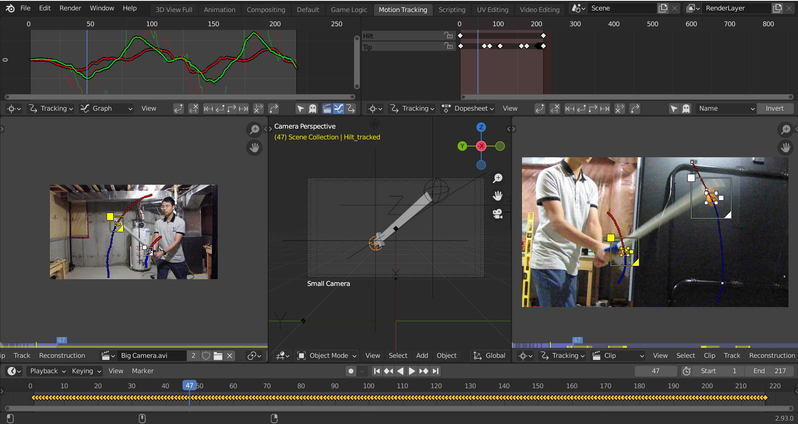

Resolve Camera Track
====================

Addon for [Blender](http://www.blender.org/) implementing 3D point reconstruction using multiple camera angles.

Rationale
---------

Blender's standard 2D and 3D tracking is pretty effective at what it was designed to do. However, there are limits on the quality of the 3D tracking done from only one camera angle.

If we use multiple cameras put in different places, we can obtain depth perception, though we can't use this directly in Blender. This addon adds the ability to resolve tracking points made from multiple cameras together into a single scene.

Essentially, this addon implements 3D tracking using multiple 2D tracks. The user performs 2D tracking with two or more cameras, then combines these 2D tracks into a 3D animation. With the 3D tracked data, we can control rigs, reconstruct scenes, and greenscreen with better accuracy than ever before.

Installation
------------

The process is the same as any other Blender addon:

1. Open the User Preferences window (Ctrl + Alt + U) to the "Addons" tab.
2. Press "Install from File..." at the bottom of the window.
3. In the resulting file browser pane, select `Resolve Camera Tracks.py`.
4. The addon entry should appear in the user preferences window.
5. Check the checkbox at the top right of the entry, beside the running man icon.

Alternatively, run the script from within a Text Editor window.

Workflow
--------

The following is a recommended workflow for working with the addon:

1. In the real world, mark a point on the ground as the real reference point. This is the center of the stage, so to speak.
2. Pick a point in Blender as the virtual reference point. The origin is generally a good choice.
3. Set up two or more cameras facing the reference point. For two cameras, the best setup is having the cameras facing 90 degrees to each other.
4. In Blender, add the same number of cameras, and set their properties such as sensor size and focal length to the same values as the real-world cameras. These values can often be found online by searching for the camera model online, or in the camera user manual.
5. Measure and record the location and orientation of each real camera relative to the reference point.
6. Move the Blender cameras so that they are at the same location and orientation relative to the virtual reference point as their associated real cameras.
7. Start recording with all cameras. This doesn't have to be at exactly the same time, but they do need to be matched up later.
8. Begin the performance near the reference point, ensuring that points of interest are visible to the cameras as much as possible.
9. Stop recording with all cameras.
10. Synchronize and trim the video footage from all cameras with a video editor such as Avidemux, or do this within Blender.
11. Ensure the video footage from all cameras match up in real time.
12. In Blender, track the points of interest using the motion tracker, ensuring the camera settings such as focal length are set to the same as the real cameras, and that tracks for any given feature have the same name across all videos.
13. For each video, select all the tracks and use `Movie Clip Editor > Reconstruction > Link Empty to Track`, making sure they are associated with the correct Blender camera.
14. Select all the generated empties, and invoke `View3D > Object > Resolve Camera Tracks`.
15. You should now have a set of Empty objects that track in 3D the locations of the real-world markers. These can now be used for animation, such as setting these as hooks for a rig.

Usage
-----

The operator is accessible via `View3D > Object > Resolve Camera Tracks`, or `Search > Resolve Camera Tracks`.

### Before

* The videos are shot from two or more non-moving cameras facing the target at different angles.
* The videos from all camera angles are synchronized and begin at the same point in real time.
* There are the same number of Blender cameras, positioned in the same orientation and relative position.
* The Blender cameras are calibrated with respect to focal length and sensor size.
* Your videos has been tracked - there are virtual markers in Blender tracking each real world point of interest on your target.
* The tracks for any given point of interest are named the same across all the videos.
* Each track has an associated Empty object linked to its path on its corresponding camera (this is done using `Movie Clip Editor > Reconstruction > Link Empty to Track` while the desired camera is set to the default scene camera).

### During

1. Select all the Empty objects generated by all the invocations of `Movie Clip Editor > Reconstruction > Link Empty to Track` previously.
2. Invoke the Resolve Camera Tracks operator from the menu or searchbar, as described above.

### After

There should be new Empty objects with their location animated such that at every frame, it **tracks the physical marker in 3D**.

The resulting Empty objects will only be keyframed when at least 2 of the Blender markers they are tracking are enabled - when their 3D position can be unambiguously determined.

Possible errors include:

* `Non-empty object "SOME_OBJECT" selected`: SOME_OBJECT was not of the type Empty.
    * Select only empty objects.
* `At least two objects associated with tracks named "SOME_TRACK" required, only one selected`: there was only one object associated with tracks named SOME_TRACK.
    * Select two or more Empty objects associated with tracks named SOME_TRACK.
* `Follow Track constraint for "SOME_OBJECT" not found`: SOME_OBJECT was missing the Follow Track constraint that makes it follow a motion track.
    * Ensure SOME_OBJECT has a Follow Track constraint.
    * Ensure SOME_OBJECT is an Empty object created by `Movie Clip Editor > Reconstruction > Link Empty to Track`.
* `Clip for constraint "SOME_CONSTRAINT" of "SOME_OBJECT" not found`: SOME_OBJECT's Follow Track constraint did not have its clip property set.
    * Check the Follow Track constraint settings for SOME_OBJECT to ensure the clip property is set.
    * Ensure SOME_OBJECT is an Empty object created by `Movie Clip Editor > Reconstruction > Link Empty to Track`.
* `Track for constraint "SOME_CONSTRAINT" of "SOME_OBJECT" not found`: SOME_OBJECT's Follow Track constraint did not have an associated track.
    * Check the Follow Track constraint settings for each object to ensure the Track property is set.
    * Ensure the objects are empties created from motion tracks.
* `At least 2 cameras need to be available`: the selected empties must represent views from two or more cameras, but only represented 0 or 1.
    * Select empties representing views from more than 1 camera.
    * Select more than 1 empty.
* `Lines are too close to parallel`: the rays shot from two or more cameras to their associated Empty objects are too close to parallel.
    * Shoot the footage from cameras at a larger angle apart.
    * Select only one empty per camera.
